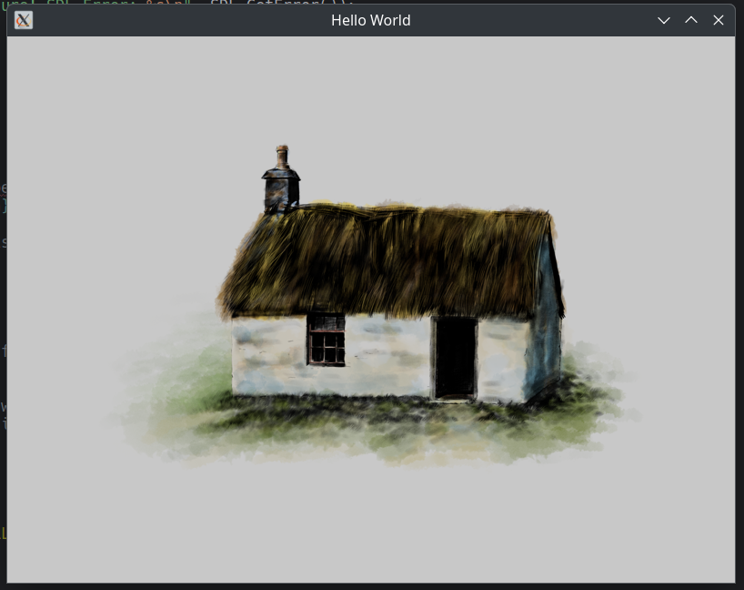
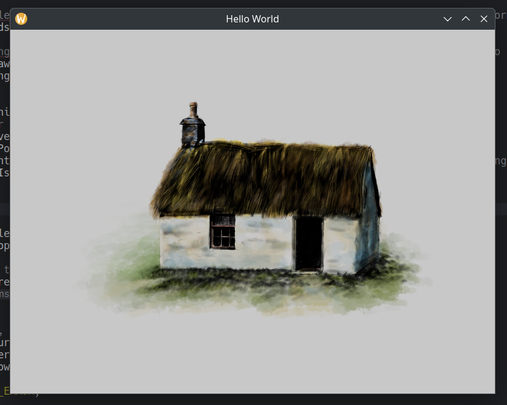

# SDL Hello Image

## SDL and OpenGL Tutorial - Part 2 

### Aim

To introduce us to image assets, how to load, examine and display them using SDL and SDL_image.

### Introduction

If your interested in part 1 go [here for SdlHelloWorld](https://github.com/Stu042/SdlHelloWorld).

If you have completed this, the next tutorial is available [here](https://github.com/Stu042/SdlGlHelloWorld)
and there we actually start to use OpenGL.

### Advanced CMake Configuration

The cmake configuration will download SDL2 and SDL2_image, then link it with your project.
Also cmake will copy the image to an assets folder that the compiled executable will be able to access.

### To Build

#### Linux Command Line

```shell

cd /path/to/SdlHelloImage
cmake -Bbuild -H.
cmake --build build --target all
```

### To Run

#### Linux Command Line

```shell

cd build
./SdlHelloImage
```

For wayland
```shell

cd build
env SDL_VIDEODRIVER=wayland ./SdlHelloImage

```


After compilation and running you should end up with something like:


and if you run it after setting environment variables of `SDL_VIDEODRIVER=wayland`


Note that at the time of writing this I get errors when run using the Wayland driver:

```
warning: queue 0x5555557ce180 destroyed while proxies still attached:
wl_callback#35 still attached
wl_surface#33 still attached
```

Probably best to use the default, X11, driver for now.
